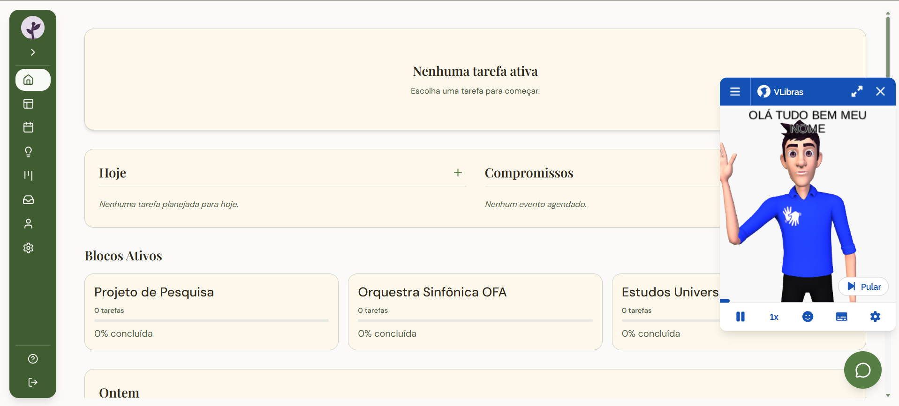
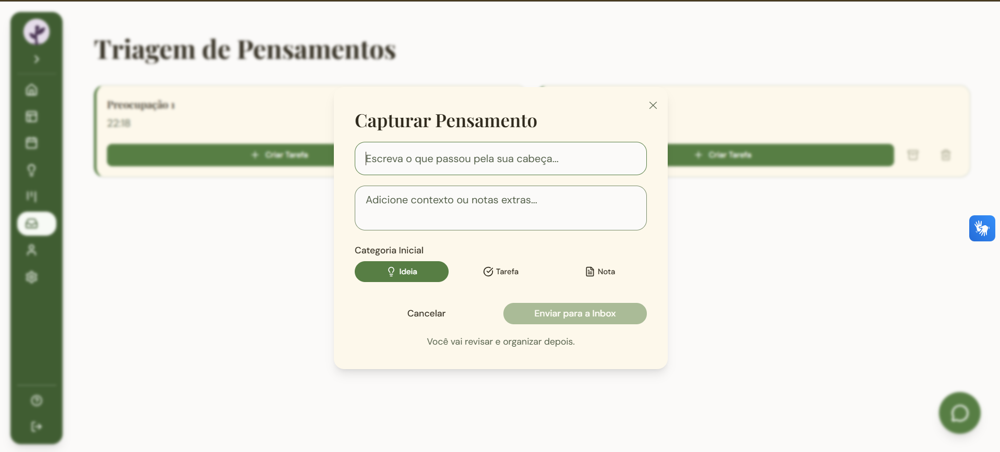
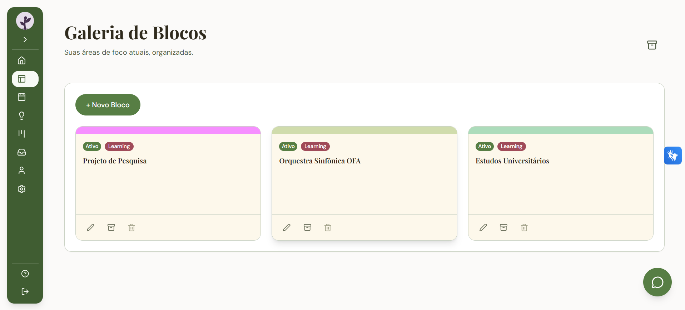
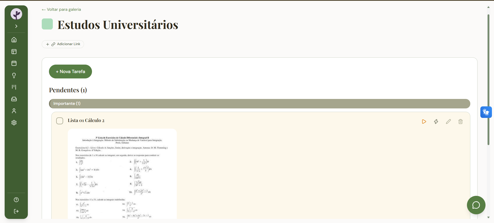
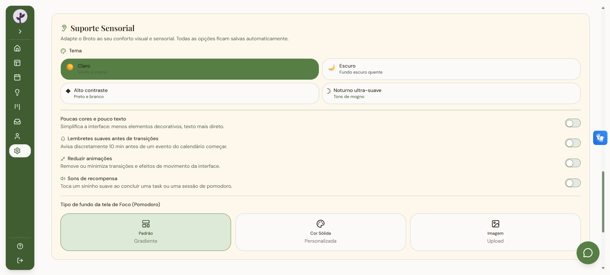

# 🌱 Broto

> Organização modular, acessível e sem pressão para o seu dia a dia.

🔗 **Acesse a versão de testes:** [broto-app-lqw9.vercel.app](https://broto-app-lqw9.vercel.app/)

⚠️ **Nota:** O Broto está em fase inicial de desenvolvimento. A ideia central daqui em diante é realizar estudos cada vez mais aprofundados para melhorar a experiência do usuário (UX). O objetivo final é tornar o aplicativo cada vez mais modular, investindo pesadamente em opções de personalização (como as peças de um **quebra-cabeça**) dentro das configurações, para que ele se adapte perfeitamente à sua rotina e não o contrário.

Tudo isso construído com um forte compromisso com a **acessibilidade**, garantindo que a tecnologia seja uma aliada inclusiva para todos os públicos.

---

## ✨ Funcionalidades

O Broto vai além das telas mostradas nos prints. O ecossistema está sendo preparado para ser uma central completa de produtividade saudável:

*   🧩 **Galeria de Blocos (Organização Modular):** 
    Sua vida não é uma lista única. Organize suas áreas de foco (ex: Estudos Universitários, Projetos, Trabalho, Orquestra) em blocos independentes, personalizáveis com cores e categorias (tags).
*   📥 **Triagem de Pensamentos (Inbox):** 
    Um espaço rápido para capturar ideias passageiras antes que elas sumam. O objetivo é esvaziar a mente primeiro e, com calma, classificar o pensamento como uma **Ideia**, uma **Tarefa** ou uma **Nota**.
*   ⏱️ **Foco com Pomodoro Integrado:**
    Ferramentas para executar o trabalho com intervalos saudáveis (utilizando timers baseados na técnica Pomodoro), diretamente ligados às tarefas dos blocos.
*   💡 **Ideias Futuras:** 
    Um ambiente totalmente sem pressão dedicado a guardar inspirações, links e possibilidades que você quer explorar um dia, mas que não precisam da urgência de um prazo.
*   ✅ **Gestão de Tarefas Dinâmicas:** 
    Dentro de cada bloco, as tarefas são criadas e monitoradas com barras de progresso (ex: "33% concluída"), dando uma visão clara e motivadora de avanço.
*   ♿ **Acessibilidade Nativa (VLibras):** 
    Interface projetada desde o dia 1 para inclusão, contando com integração nativa com o **VLibras** para tradução automática do conteúdo, além de contrastes amigáveis.
*   🤝 **Suporte e Feedback Direto:**
    Um canal dedicado dentro do app para contato, dúvidas e sugestões, permitindo que a comunidade molde as próximas ferramentas.
*   🔐 **Autenticação Simples e Segura:** 
    Login tradicional e autenticação social rápida (Google/GitHub) powered by Supabase.

---

## 📸 Conheça o Broto

*(Algumas telas da versão atual)*

### Dashboard Principal & VLibras


### Triagem Rápida de Pensamentos


### Galeria de Blocos (Seus Projetos)


### Gestão de Tarefas


### Central de Suporte


---

## 🛠️ Tecnologias Utilizadas

O app é robusto e foi construído utilizando tecnologias modernas para garantir performance em qualquer tela:

*   **Front-end:** React, Vite, TypeScript
*   **Estilização e UI:** Tailwind CSS, Skeletons para loading states.
*   **Back-end & Banco de Dados:** Supabase (PostgreSQL)
*   **Autenticação:** Supabase Auth (OAuth)
*   **Acessibilidade:** Integração com Widget VLibras

---

## 🚀 Como rodar o projeto localmente

1. **Clone o repositório:**
   ```bash
   git clone https://github.com/AlaneDantass/Broto-App.git
   ```

2. **Entre na pasta do projeto:**
   ```bash
   cd Broto-App/broto
   ```

3. **Instale as dependências:**
   ```bash
   npm install
   ```

4. **Variáveis de Ambiente:**
   Crie um arquivo `.env.local` na raiz com suas chaves do Supabase:
   ```env
   VITE_SUPABASE_URL=sua_url_aqui
   VITE_SUPABASE_ANON_KEY=sua_chave_aqui
   ```

5. **Inicie o projeto:**
   ```bash
   npm run dev
   ```

---

